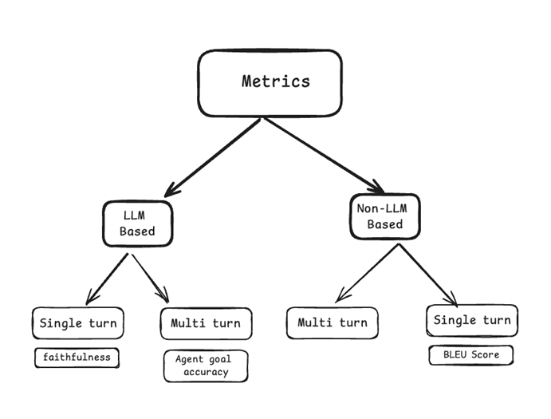

# RAG-Evaluation
Topics we will cover 
* Basic Retrieval Augmented Generation workflow.
* Why we need to evaluate RAG applications.
* Types of evaluating metrics with code examples.
* Test-Data Generation for given document source
* Unit Testing RAG in CI/CD Pipelines 


## Overview of Metrics
A metric is a quantitative measure used to evaluate the performance of a AI application.


**LLM-based metrics** : 
These metrics uses `LLM` underneath to do the evaluation.

```python
from ragas.metrics import FactualCorrectness
scorer = FactualCorrectness(llm=evaluation_llm)
```
Each LLM based metrics also will have prompts associated with it written using Prompt Object.

**Non-LLM-based metrics**: 
These metrics `do not use LLM` underneath to do the evaluation.Instead uses string similarity and BLEU score etc.Hence these metrics are known to have a lower correlation with human evaluation.

**Single turn metrics**: It's a single turn interaction between Human and AI
```python
from ragas.metrics import FactualCorrectness

scorer = FactualCorrectness()
await scorer.single_turn_ascore(sample)
```

**Multi turn metrics**: It's a Multi turn interaction between Human and AI
```python
from ragas.metrics import AgentGoalAccuracy
from ragas import MultiTurnSample

scorer = AgentGoalAccuracy()
await scorer.multi_turn_ascore(sample)
```

## Basic RAG workflow

The idea behind the RAG framework is to combine a retrieval model and a generative model.

.gif?w=708)

### Indexing

Indexing is the first important step in preparing data for language models. The original data is cleaned, converted to plain text, and broken into smaller chunks for easier processing.

These chunks are then turned into vector representations using an embedding model, which helps compare similarities during retrieval. The final index stores these text chunks and their vector embeddings, allowing for efficient and scalable searches.

### Retrieval

When a user asks a question, the system uses the encoding model from the indexing phase to convert the question into a vector. It then calculates similarity scores between this vector and the vectorized chunks in the index.

The system retrieves the top K chunks with the highest similarity scores, which are used to provide context for the user’s request.

### Generation

The user’s question and the selected documents are combined to create a clear prompt for a large language model. The model then crafts a response, adjusting its approach based on the specific task.

Now that we have a basic understanding of how the RAG workflow operates, let's move on to the evaluation phase.

Why we need to **evaluate** RAG applications?
--------------------------------------------

Evaluating RAG applications is important for understanding how well these pipelines work. We can see how effectively they combine information retrieval with generative models by checking their accuracy and relevance.

This evaluation helps improve RAG applications in tasks like 
- text summarization tasks, 
- chatbots,
- question-answering. 

It also identifies areas for improvement, ensuring that these systems provide trustworthy responses as information changes.

Overall, effective evaluation helps to 
- optimize performance and 
- builds confidence 

in RAG applications for real-world use.

How to Evaluate RAG applications?
---------------------------------

To evaluate a RAG application we focus on these main elements:

*   **Retrieval**: Experiment with various data processing strategies and embedding models to see how they affect retrieval performance.
*   **Generation**: After selecting the best settings for retrieval, test different large language models (LLMs) to find the best model for generating completions for the task.

To evaluate these elements, we will focus on the **key metrics** commonly used in RAG evaluation:

*   Context Precision
*   Context Recall
*   Answer Relevancy
*   Faithfulness

Let's break down each of the evaluation metrics one by one.

Context Precision
-----------------

Context Precision evaluates how well a retrieval system ranks the relevant pieces/chunks of information compared to the ground truth.

This metric is calculated using the query, ground truth, and context. The scores range from 0 to 1, with higher scores showing better precision.

### Formula:


k = retrieved chunks (or contexts) are relevant to the task

K = The total number of chunks in the retrieved contexts

### Example:

Consider we have 3 different examples which are in list format:

**Questions** = What is SpaceX?, Who found it?, What exactly does SpaceX do?

**Answers** = It is an American aerospace company, SpaceX founded by Elon Musk, SpaceX produces and operates the Falcon 9 and Falcon rockets

**Contexts** = SpaceX is an American aerospace company founded in 2002, SpaceX founded by Elon Musk, is worth nearly $210 billion, The full form of SpaceX is Space Exploration Technologies Corporation

**Ground Truth** = SpaceX is an American aerospace company, Founded by Elon Musk, SpaceX produces and operates the Falcon 9 and Falcon Heavy rockets

### Solution:

**For Question 1:** The **Ground Truth** is relevant to the **Context.** So, this is a true positive (TP), and there are no false positives (FP). Therefore, the context precision here is **1**.


Similarly **,** for **Question 2,** the context precision is **1**.

But,

**For Question 3:** The **Ground Truth** is not relevant to the **Context.** Therefore, this is a false positive (FP), with no true positives (TP). Thus, the context precision here is **0**.


For the average contextual precision with K=3, we assume equal weights Vk​=1, so our final answer becomes:


